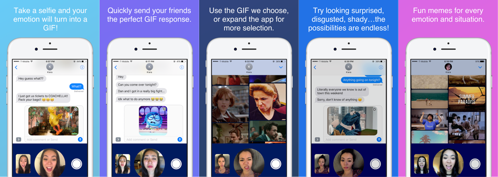

# WinkChat #

iMessage app that turns your selfies into GIFs! Make a face, and with one picture we'll find you the perfect GIF based off of your emotion. If it's not quite what you want, easily find other options by expanding the app. Add animated gifs easily into your conversation with one click without leaving iMessage. WinkChat makes finding the GIF response you're looking for way more fun, quick, and dynamic!

## Getting Started

1. [Download](https://developer.apple.com/download/) the Xcode 8.3 release.
2. Clone this repository.
3. Run `pod install` to install dependencies.
4. Get a key for [GIPHY API](https://developers.giphy.com/).
5. Get a key for [Microsoft Emotion API](https://azure.microsoft.com/en-us/services/cognitive-services/emotion/).
6. Replace key constants in Constants.swift with the keys you obtained from Giphy and Microsoft.
7. Run on device(simulator won't allow full functionality) and enjoy :)

## License

See the [LICENSE](LICENSE.md) file for license rights and limitations (MIT).
